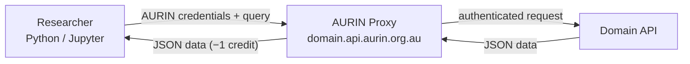
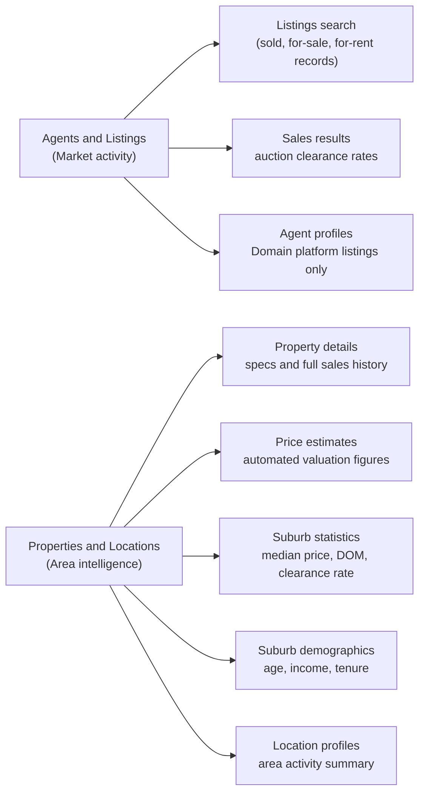
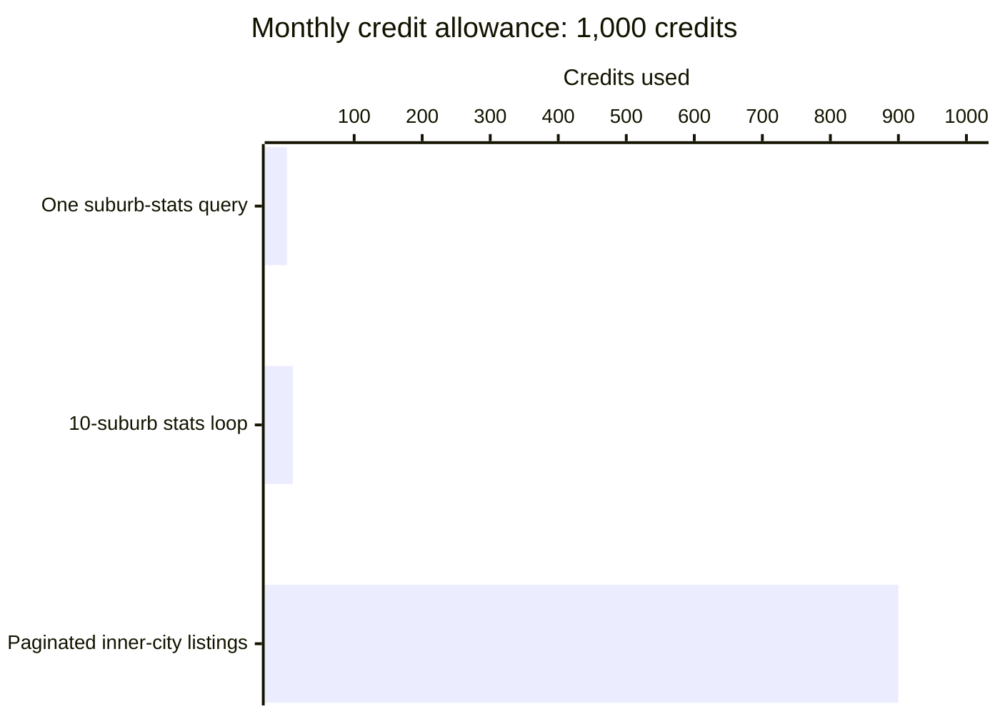

# Getting Started with the Domain API

This guide is your starting point. Before setting up credentials or writing any code, it is worth spending five minutes here to understand what the Domain API is, whether it fits your research, and how the training materials are organised.

## What Is the Domain API?

The Domain API is a live property data service. Instead of downloading a dataset once, you send queries and get back data in real time. AURIN provides access to this API through a proxy, so you authenticate with your AURIN credentials, and AURIN's server handles the connection to Domain on your behalf.

The API is organised into two broad categories of endpoints.

**Agents & Listings** covers market activity:
- Search residential listings: sold, for-sale, and for-rent records, filterable by location, price, property type, bedroom count, date listed, and more
- Sales results: weekly auction clearance rates and median prices by city (current week only, no historical data)
- Agent and agency profiles and their associated listings (limited to agencies and listings hosted on the Domain platform, not the full market)

**Properties & Locations** covers individual properties and area intelligence:
- Property details: specs, photos, and full sales and listing history for a specific address
- Price and rental estimates: automated valuation and rental yield figures for a property
- Suburb performance statistics: aggregated monthly market metrics (median sold price, days on market, clearance rate) at the suburb or postcode level, going back to approximately early 2015
- Suburb demographics: population characteristics including age distribution, household income, occupation, and tenure type
- Location profiles: a summary of property activity and pricing for a suburb or area

For most urban research purposes, the **listings search**, **suburb performance statistics**, and **suburb demographics** endpoints will be the most directly useful. The agent and agency endpoints are primarily designed for real estate industry use cases rather than research.

## Could This Data Help Your Research?

The table below provides typical questions that this API answers well: "How have median sold prices in suburb X changed over the past three years?" or "What rental stock is currently available in these postcodes?" or "Which suburbs had the shortest time on market last year?" or "What is the age and income profile of residents near this development site?"

| Research need | Example research question | Domain API |
|---|---|---|
| Individual sold property records | "What 4-bedroom, 2-bathroom properties were sold in Fitzroy in February 2023?" | Yes |
| Individual for-sale or for-rent listings | "What rental properties are currently listed in these five postcodes?" | Yes |
| Suburb-level or postcode-level price trends | "How has the median sold price in Richmond changed over the past three years?" | Yes |
| Days on market as a demand signal | "Which inner-city suburbs had the fastest-selling properties last quarter?" | Yes |
| Rental asking prices and stock levels | "What is the median asking rent for 2-bedroom units in Parramatta right now?" | Yes |
| Suburb demographic profiles | "What is the age, income, and tenure mix of residents near a proposed transit corridor?" | Yes |
| Weekly auction clearance rates by city | "What was Sydney's clearance rates last weenend?" | Yes |
| Aggregated market stats going back before early 2015 | "What were median prices during the 2012 boom?" | No, coverage is limited or incomplete prior to approximately early 2015 |
| Individual listing records going back before 2018 | "What were apartments renting for in 2015?" (expect many gaps) | Technically yes, but coverage is very sparse |
| SA2, SA3, or SA4 level aggregations out of the box | "What is the average price per SA2 across Greater Sydney?" | No, requires converting ABS boundary files and extra scripting |
| Bulk export of all records for a region | "Give me every sold listing in Queensland from 2020 to 2024" | No, the API is query-by-query, not a bulk download |
| Comparison of original asking price to final sold price | "Did this property sell above or below its original list price?" | No, Domain overwrites asking price once a property sells |
| Tracking one property's price across multiple sales over decades | "What did this house sell for in 2005, 2012, and 2022?" (records go back to roughly 2000 but gaps are common) | Partial, completeness varies by property |

> ⚠️ **If your research depends on any of the "No" rows**, the Domain API may not be the right fit, or it will require substantially more work than a direct query. It is better to find this out now than after spending your monthly credit allowance.

If your needs are mostly in the "Yes" rows, you are in the right place.

## What You Will Need

Before you start the setup steps in the next guide, make sure you have:

- **An institutional affiliation**: AURIN access requires a university or research organisation login
- **A research question defined**: the API charges per query, so you need to know what you are looking for before you start pulling data
- **Basic Python familiarity**: you do not need to be an expert, but you will be running Python scripts and Jupyter notebooks; the guides walk you through every step
- **A terminal and the ability to install packages**: if you have never done this before, the [Data Access Guide](./01-data-access-guide.md) has a Python setup checklist at the bottom for first-time users

## The Cost Model

Every query you send to the Domain API costs **one credit** from your monthly allowance. Each AURIN researcher account has **1,000 credits per month**, which resets automatically on the first of each calendar month.

> 💡 Unlike a dataset you download once and analyse freely, every API call here has a price. Treat your 1,000 credits like a monthly budget. The most common mistake is running exploratory, open-ended queries to "see what's there" before designing the study, this can exhaust credits quickly with nothing useful to show for it. **Design your research question first, then query.**

The [Credit Calculator guide](./03-credit-calculator.md) covers how to estimate your total call count before running anything. In particular, read the [Individual Listings Queries](./03-credit-calculator.md#individual-listings-queries-cost-depends-on-how-much-data-exists) section before running any listings query — this is where most researchers inadvertently exhaust their monthly credits.

## A Map of These Training Materials

Use this table to find the right guide for where you are in the process.

| Guide | What it covers | Start here when... |
|---|---|---|
| [01. Data Access Guide](./01-data-access-guide.md) | Step-by-step: signing the access agreement, finding your credentials, storing them safely, and running your first test call | Everyone start here |
| [02. The Paradigm Shift](./02-paradigm-shift.md) | How the Domain API compares structurally to APM (the previous AURIN property dataset) | You previously worked with APM data through AURIN |
| [03. Credit Calculator](./03-credit-calculator.md) | How to estimate query costs before running a data pull | You have a research design and want to budget your credits |
| [04. API Gotchas](./04-api-gotchas.md) | Known API quirks, silent failure modes, and how to defend against them | Before you write any extraction code |
| Phase 2 Notebooks | Reusable Python notebooks for common challenges: pagination (the API returns at most 1,000 records per response, unrelated to your credit allowance), spatial querying, suburb stats, and resilient large-scale extractions | When you are writing or adapting code for your own study |

## Your Next Step

**Everyone starts here:** [Data Access Guide](./01-data-access-guide.md). It will walk you through the full setup and have you making your first test query in under an hour.

**If you previously worked with APM data through AURIN**, also read the [Paradigm Shift guide](./02-paradigm-shift.md). It is best read after you have gotten your first successful call, the comparison to APM's bulk-extract model is more concrete once you have seen the proxy, the credit counter, and the live-query pattern in action.
