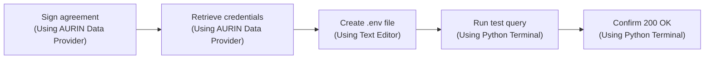
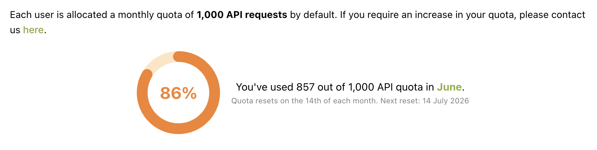

# Navigating AURIN Data Access

This guide walks you through everything you need to get from zero to a working connection to the Domain API, including what to do when things go wrong.




## Before You Start

You will need three things:

- **An academic or institutional affiliation**, AURIN access requires an institutional login (university or research organisation)
- **Python installed on your computer**, if you have never used Python before, jump to the [Python setup checklist](#python-setup-checklist-for-first-time-users) at the bottom of this guide first, then come back here
- **A signed Domain API access agreement**, this is a short online form inside the AURIN Data Provider; Step 1 below walks you through it


## Step 1: Sign the Access Agreement

The Domain data is provided by AURIN under a specific data licence. AURIN requires you to accept this licence before your account can make any API calls. This is a one-time step, once signed, it stays active on your account.

**How to sign it:**

1. Browse to [data.aurin.org.au](https://data.aurin.org.au) and log in
2. From the top menu, hover over **Manage Access**
3. Select **My Agreements** from the dropdown
4. Under *Available Agreements*, find the **Domain API** agreement and click **Open**
5. Read through the data transfer agreement and, if you agree, click **Accept**


> ⚠️ **What happens if you skip this:**
> Your API calls will fail with an error that says *"To gain access, you would need to sign the Domain API agreement below."* Confusingly, you will see this same message if your monthly credit balance runs out, not just when the agreement is unsigned. If you see this error at any point, the first thing to do is check your credit balance (Step 5 below), not try to re-sign the agreement.


## Step 2: Find Your Access Credentials

Think of the AURIN Data Provider as a library card system. Your AURIN username (your institutional email) and password are your library card. Every time your code queries the API, it shows that card automatically, you don't need to log in each time, but your credentials need to be available to your code.

Your credentials are the same ones you use to log into the AURIN Data Provider. To confirm them and see your credit quota:

1. Log in to [data.aurin.org.au](https://data.aurin.org.au)
2. From the top menu, hover over **Manage Access** and click **API Access**
3. This is where you see your AURIN credentials (basically your AURIN username and password).
4. Moreover, you will see two other sections on this page:
   - **AURIN Data Access (WFS)**, for accessing AURIN-hosted datasets (not relevant here).
   - **Domain Access**, this shows your Domain data quota, credit balance, and the proxy URL to use in your code.


The proxy URL shown on that page is:
```
https://domain.api.aurin.org.au
```

All your API calls go to this address, not directly to Domain's website. AURIN's server sits in between, checks your credentials and credit balance, then forwards the request. This is why your AURIN username and password are what matter, not a Domain account.


## Step 3: Store Your Credentials Safely

> 💡 **New to Python?** Steps 3 and onwards require Python to be installed and a few packages available. If you haven't set this up yet, jump to the [Python setup checklist](#python-setup-checklist-for-first-time-users) at the bottom of this page, then come back here.

It is best practice to avoid typing your password directly into a notebook or Python script, because if you ever share the file, your credentials could become visible to others. The recommended approach is to store them in a separate private file called a `.env` file.

> 💡 **If this feels like too many steps for now:** you can temporarily type your credentials directly into your script while you are working locally on your own computer. Just be careful not to share that file with anyone. The `.env` approach is worth setting up properly once you are comfortable.

**What is a `.env` file?**
It is a plain text file (like a Notepad or TextEdit document) that sits in your project folder and holds sensitive values such as passwords. Your Python code reads from this file automatically when it starts up, so your credentials stay out of your scripts.

**How to create it:**

1. Open the folder where your notebooks or Python scripts live
2. Create a new plain text file called `.env` (the dot at the start is required; there is no `.txt` extension)
3. Paste the following two lines into it, replacing the example values with your real AURIN email and password:

```
AURIN_USERNAME=your.email@institution.edu.au
AURIN_PASSWORD=your_aurin_password
```

4. Save the file and close it

> 💡 On Windows, Notepad works fine. On Mac, use TextEdit, but switch it to plain text mode first (Format → Make Plain Text) before saving.

**If you are using git for version control**, make sure git ignores this file so it is never accidentally uploaded. Open the file called `.gitignore` in your project folder (or create one if it doesn't exist) and add this line:
```
.env
```

**How your code reads the credentials:**

At the top of your notebook or Python script, include these lines. You only need to do this once per file:

```python
import os
from dotenv import load_dotenv
from requests.auth import HTTPBasicAuth

load_dotenv()  # reads your .env file and makes its values available

AURIN_USERNAME = os.getenv("AURIN_USERNAME")  # retrieves your email from .env
AURIN_PASSWORD = os.getenv("AURIN_PASSWORD")  # retrieves your password from .env
PROXY_AUTH = HTTPBasicAuth(AURIN_USERNAME, AURIN_PASSWORD)  # packages them for API calls

PROXY_BASE_URL = "https://domain.api.aurin.org.au"  # the AURIN proxy address
```

What this does in plain terms:
- `load_dotenv()`, opens your `.env` file and reads the values into memory
- `os.getenv("AURIN_USERNAME")`, retrieves the value you stored under that label
- `HTTPBasicAuth(...)`, bundles your credentials into the format that gets sent with each API request (like attaching a signed permission slip to every query)
- `PROXY_BASE_URL`, the web address all your queries will be sent to

> 💡 **If `.env` is not in the same folder** as your script, give `load_dotenv()` the path to it, for example `load_dotenv("../../.env")`.

> 💡 **Watch out when you copy and paste a folder path.** Paths look different depending on the operating system you are using. Windows file manager gives you backslashes (`C:\Users\you\project`), while Mac and Linux give you forward slashes (`/Users/you/project`). Pasting a Windows path straight into Python causes an error or silently changes the path, because a single backslash has a special meaning inside quotes. Either double each backslash (`"C:\\Users\\you\\project"`), put an `r` in front of the quotes (`r"C:\Users\you\project"`), or swap the backslashes for forward slashes (`"C:/Users/you/project"`), which Python understands on every operating system. On Mac and Linux, the path you copy already uses forward slashes, so it works as is.

> 💡 **First time only:** If you see an error saying `ModuleNotFoundError: No module named 'dotenv'`, you need to install the required packages. Open a terminal (or the terminal inside JupyterLab) and run:
> ```
> pip install requests python-dotenv
> ```
> Then re-run the code block above.


## Step 4: Test That Everything Works

Once your `.env` file is set up and your code has loaded the credentials, run this short test to confirm the connection is working. Open a new notebook cell or Python file and copy this code exactly:

```python
import requests

url = f"{PROXY_BASE_URL}/v2/suburbPerformanceStatistics/VIC/Carlton/3053"
params = {
    "propertyCategory": "House",
    "periodSize": "quarters",
    "totalPeriods": 1,
}

r = requests.get(url, params=params, auth=PROXY_AUTH,
                 headers={"accept": "application/json"})

print(f"Status: {r.status_code}")
print(f"Body length: {len(r.text)} chars")
```

This asks the API for one quarter (a three-month period) of suburb statistics for Carlton, VIC. It costs 1 credit.

**What a successful result looks like:**
```
Status: 200
Body length: #### chars
```
A status of `200` means success. A body length greater than zero confirms data came back.

**What a failure looks like:**
- `Status: 200` but `Body length: 0` → your credentials are fine but something is wrong with the query (suburb name, postcode, or a GET header issue). See the troubleshooting section below.
- `Status: 401` → credentials not accepted. Check your `.env` file values.
- `Status: 403` → either agreement not signed or credit balance at zero. Check the dashboard (Step 5).


## Step 5: Check Your Credit Balance Before Every Large Run

Your account has **1,000 API calls per month**. These refill automatically on the 1st of each calendar month, you do not need to do anything to reset them.

There is no way to check your remaining balance programmatically. The only place to see it is inside the AURIN Data Provider:

1. Log in to [data.aurin.org.au](https://data.aurin.org.au)
2. Hover over **Manage Access** → click **API Access**
3. Look at the **Domain Access** section, it shows your current usage and monthly limit

**Check your credit balance before every large run.** If your code loops over 50 suburbs and you only have 30 credits left, it will run until the credits run out, with no warning, and you will be left with an incomplete dataset that you cannot cheaply re-run.




## Troubleshooting: What the Error Messages Mean

### "Status: 200 but Body length: 0" (empty response, no error)
Your request reached the server successfully, but it returned nothing. This usually means:
- The suburb name is misspelled (try Carlton, not Carltn)
- The postcode does not match the suburb.
- Less commonly: your code is sending a `Content-Type` header on a GET request, this silently breaks the response. See the [Gotchas guide](./04-api-gotchas.md) for details.

### "Status: 400" (bad request)
Your request contained an invalid parameter, for example, typing `"four"` where the API expects the number `4`. Fix the parameter and try again. **Note: this still consumed 1 credit**, even though it failed. See [Gotcha 4](./04-api-gotchas.md#gotcha-4-malformed-requests-http-400-still-consume-a-credit).

### "Status: 401" (not authorised)
Your credentials were not accepted. Check:
- Is your `.env` file in the same folder as your notebook/script?
- Did you call `load_dotenv()` before trying to use the credentials?
- Is the email and password in `.env` identical to what you received on AURIN Data Provider(e.g., no extra spaces and no missing characters at the beginning or end of the long password)?

### "Status: 403, To gain access, you would need to sign the Domain API agreement"
This message is confusing because it is used for **two completely different problems**:

1. **You haven't signed the access agreement yet** → go to the AURIN Data Provider → Manage Access → My Agreements and sign it
2. **Your monthly credit balance has reached zero** → check the Dashboard (Step 5). If the counter shows 0, wait until the 1st of the month for the automatic refill, or contact AURIN if you need an urgent top-up

Always check the credit balance first before concluding something is wrong with your account setup.


## Python Setup Checklist for First-Time Users

If you have never used Python before, work through this list first:

1. **Install Python**, download Python 3.9 or later from [python.org/downloads](https://www.python.org/downloads/). Follow the installer instructions. On Windows, tick "Add Python to PATH" during installation.

2. **Install JupyterLab** (recommended for running notebooks), open a terminal (on Mac: Terminal app; on Windows: Command Prompt or PowerShell) and run:
   ```
   pip install jupyterlab
   ```

3. **Install the packages this guide needs:**
   ```
   pip install requests python-dotenv
   ```

4. **Start JupyterLab:**
   ```
   jupyter lab
   ```
   This opens a browser window where you can create and run notebooks.

5. **Create your `.env` file** as described in Step 3 above

6. **Run the verification code** in Step 4

Once the verification test shows `Status: 200` with a non-zero body length, you are ready to move on to the [Credit Calculator](./03-credit-calculator.md).
