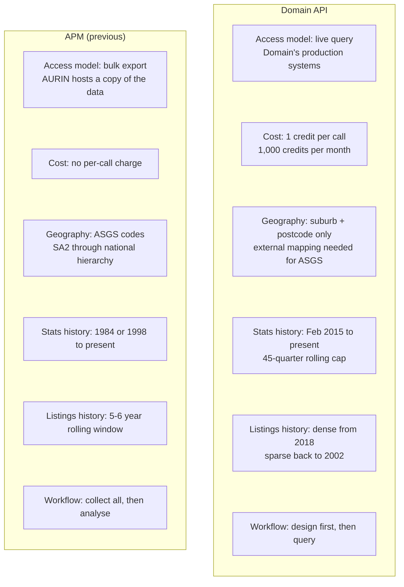
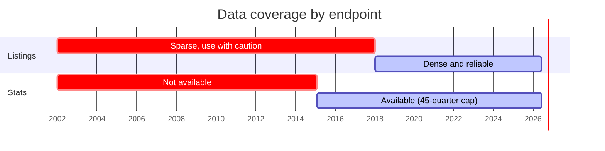
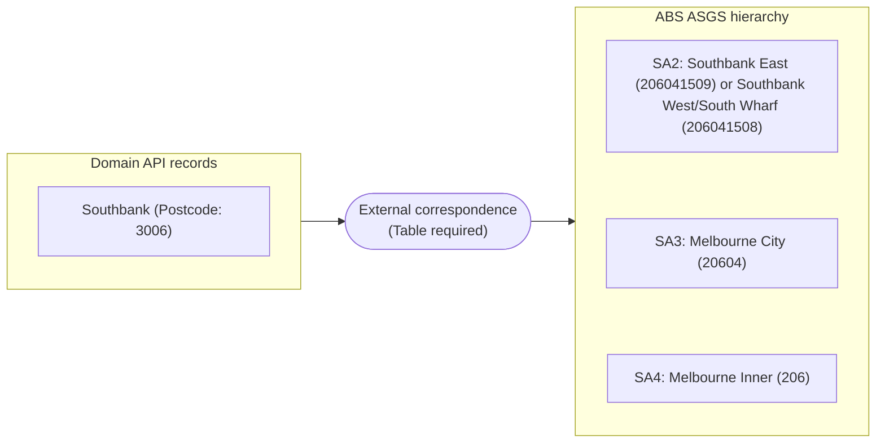

# The Paradigm Shift: APM vs. Domain API

This guide is for researchers who previously worked with APM data through AURIN. Before writing a single line of code, it is worth understanding how the Domain API is fundamentally different from what came before, and what that means for your research design.

If you are new to property data entirely and did not use APM, you can skip this guide and go straight to the [Data Access Guide](./01-data-access-guide.md).

## What APM Gave You

APM delivered two distinct data products to AURIN researchers.

**Point Level Data** covered individual property market events, for sale, for rent, and sold listings, across all 8 states and territories. Each record included an ASGS geographic code, event date, and precise latitude/longitude coordinates. APM maintained a rolling 5–6 year window of these records.

**Timeseries Data** was aggregated monthly statistics across a full hierarchy of ASGS geographies: SA2, SA3, SA4, Postcode, Suburb, State, National, and Capital Cities. Depending on the ASGS edition, this data reached back to 1984 (ASGS 2011 edition) or 1998 (ASGS 2016 edition). You could pull a 30-year price trend for a single SA3 in one query.

The key characteristic of both products: **AURIN ingested and hosted the data**. You queried AURIN's copy. There was no call limit, no per-query cost, and no concern about exhausting access.

## What the Domain API is

The Domain API is a fundamentally different kind of product. Domain does not deliver bulk data extracts. Instead, it provides a **live query interface**, you pull data on demand, one query at a time, directly from Domain's production systems.

Every query you submit:
- Costs one API credit from your monthly allowance
- Returns only what that specific query asks for
- Is rate-limited and capped per user per month

This is not a better or worse data model, it is a structurally different one. The APM workflow was: *get all the data once, then analyse it*. The Domain API workflow is: *design your analysis first, then query only what you need*.

The API is organised into two main endpoint categories: **Agents & Listings** (residential listings search, sales results, agent and agency data) and **Properties & Locations** (individual property details, price and rental estimates, suburb performance statistics, and suburb demographics). For most research use cases, the listings search and suburb performance statistics endpoints will be the most directly relevant, and they are the focus of most of the comparisons in this guide.

## Coverage Map: APM vs. Domain API

Domain also adds two capabilities APM did not have: **property-level price and rental estimates** (`/v1/properties/{id}/priceEstimate`, `/rentalEstimate`) and **suburb demographics** (`/v2/demographics/{state}/{suburb}/{postcode}`).

## Historical Depth: Know Your Endpoint's Floor

This is the single most important difference to understand before designing a study, and the two Domain API endpoints have **different historical floors**.

| Endpoint | How far back | Notes |
|--|---|---|
| `/v1/listings/residential/_search` | `dateListed` back to ~2002 | Data exists but is very sparse before 2018. `soldDate` on records can predate the listing date. |
| `/v2/suburbPerformanceStatistics` | ~Early 2015 | The API accepts any `totalPeriods` value but silently returns at most 45 periods. You cannot retrieve stats older than ~11 years from this endpoint, regardless of how many periods you request. |

**Practical implication:** If your research design requires property market trends from before 2015, the Domain API cannot deliver them at the aggregated statistics level. For individual transaction records, data technically exists back to 2002, but coverage is too sparse to be reliable before 2018 for most suburbs.

> The APM Timeseries Data going back to 1984 has no equivalent here. Research designs that depended on long-run price indices from APM will need to be scoped differently.

## Geography: Suburb + Postcode, Not ASGS Codes

APM records carried ASGS codes, so researchers could aggregate up the standard geographic hierarchy. The Domain API does not work this way.

**Domain's geographic model** for most queries is: **suburb name + postcode**. There is no `sa2_code` parameter, no `sa3_name` filter, and no geographic hierarchy built into the API itself.

If you need to query by SA2, SA3, or any other ABS boundary:
1. You must obtain the ABS ASGS 2021 digital boundary files separately (freely available from [The ABS website](https://www.abs.gov.au/statistics/standards/australian-statistical-geography-standard-asgs/)
2. Convert the polygon coordinates from GeoJSON format (`[longitude, latitude]`) to the Domain API's format (`{lat, lon}`)
3. Pass the polygon via the `geoWindow.polygon` parameter

This process is covered step by step in [Notebook 4: Spatial Querying](../phase-2/04-spatial-querying.ipynb).

Alternatively, you can run a correspondence mapping between suburbs/postcodes and ASGS statistical areas. Read more about [correspondence mapping here](../../metadata/correspondance/Correspondance%20-%20General.xlsx).

## The Budget Reality

Under the current AURIN contract, each researcher account has **1,000 API calls per month**. This resets on the first of each calendar month.

To put that in context, pulling one year of sold listings across Greater Melbourne can cost as low as approximately 900 calls, nearly the entire monthly allowance for a single extraction. A study that requires multiple extractions, segmented by property type or bedroom count, can exhaust a monthly budget quickly if not planned carefully.

The Domain API is well-suited to targeted, pre-designed queries. It is not suited to exploratory, open-ended data pulls where you collect everything first and decide what to use later. Research design must precede data extraction.

The [Credit Calculator guide](./03-credit-calculator.md) covers how to estimate costs before running any queries. If you have not yet set up your credentials and made a test call, the [Data Access Guide](./01-data-access-guide.md) is the place to start.

> 💡 **Need more credits?** If your research requires more data than the monthly allowance allows, contact AURIN support. There may be options available depending on your project's needs.