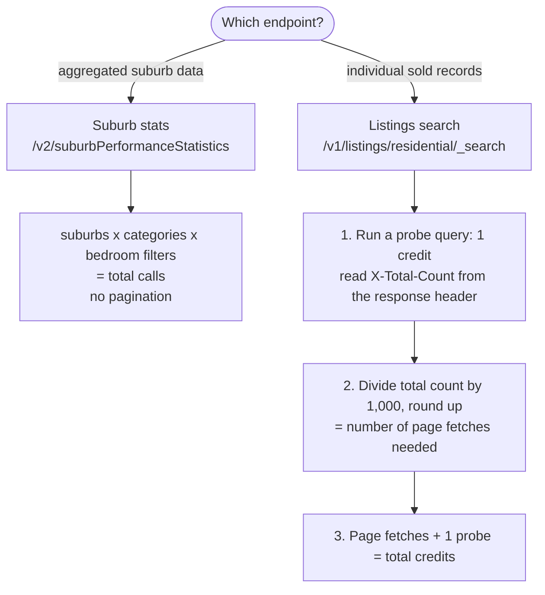
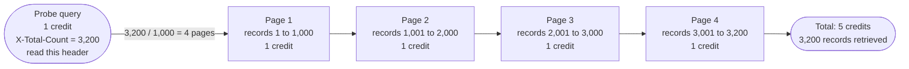

# The Query & Credit Calculator


Every API call costs exactly one credit. Once you have a working connection (set up in the [Data Access Guide](./01-data-access-guide.md)), this guide shows you how to estimate your total cost before submitting a single real query, and how to structure your queries so you get the most data for the fewest credits.

The cost models here focus on the two main research endpoints: the **listings search** and **suburb performance statistics**. These have different cost structures. `Suburb performance statistics` has a simple, predictable multiplicative cost with no pagination. Listings search can involve pagination, which is where costs can grow unexpectedly. Other endpoints in the `Properties & Locations` category (property details, price estimates, rental estimates, and suburb demographics) are simpler single-record lookups that each cost exactly 1 credit.

> 💡 **What is pagination (listings only)?** The listings search endpoint can only return up to 1,000 records in a single response. If your query matches more than 1,000 records (for example, all sold listings in Sydney over five years), you need to make multiple calls to retrieve them in batches — this is called pagination. Each batch costs 1 credit, so the total cost of a large extraction is determined by how many batches are needed, not how many records you ultimately receive. Suburb performance statistics does not have this issue. This is covered in detail in the listings cost model below.


## The Core Rule

> **1 API call = 1 credit, always.**

It does not matter whether that call returns 1 record or 1,000. It does not matter whether you request 1 historical period or 45. A call that returns an empty body (because you misspelled a suburb) still costs 1 credit. A call that returns an error because of a typo in your parameters still costs 1 credit.

This means the unit of cost is not *data volume*, it is *query count*. Your job before any extraction is to count your queries.




## Suburb Statistics Queries: Predictable, Multiplicative Cost

The suburb statistics query has a clean, predictable cost model. Cost is determined by the combination of dimensions you query across.

**Cost formula:**

```
total calls = number of suburbs × number of property categories × number of bedroom filters queried (e.g., 2-bed, 3-bed, and 4-bed)
```

| Scenario | Suburb Filters | Category Filters | Bedroom Filters | Total calls |
|---|---|---|---|---|
| One suburb, one category, no bedroom filter | 1 | 1 | — | **1** |
| 14 suburbs, one category, no bedroom filter | 14 | 1 | — | **14** |
| 14 suburbs, House + Unit, no bedroom filter | 14 | 2 | — | **28** |
| 14 suburbs, House + Unit, 5 bedroom filters | 14 | 2 | 5 | **140** |
| 14 suburbs, House + Unit, 8 bedroom filters | 14 | 2 | 8 | **224** |

Note: the API only accepts two property categories, `House` and `Unit`. These are broader groupings than the label suggests:

| `House` includes | `Unit` includes |
|---|---|
| House, Townhouse, Duplex, Triplex, Terrace, Cottage, Semi-Detached | Apartment, Unit, Flat, Studio, Villa |

Vacant land is excluded from both categories.

**The front-loading rule:** Requesting the maximum amount of history (45 months) costs the same single credit as requesting just 1 period. Always request the maximum upfront. Once you have the data, you can analyse any time window you want without spending more credits.

**Shifting the window backward in time:** If your study needs data from a specific past window rather than the most recent periods, you can shift the window backward in time. This costs the same single credit regardless of how far back you go. See [Notebook 2](../phase-2/notebook-2-suburb-statistics.Rmd) for a worked example.


## Individual Listings Queries: Cost Depends on How Much Data Exists


> ⚠️ **Read this section before running any listings query.** This is where researchers most commonly exhaust their monthly credits without realising it. Unlike suburb statistics, where cost is predictable upfront, listings costs depend entirely on how much data exists for your query, and a single poorly-scoped query can consume your entire monthly allowance.

Individual listings queries have a different cost model. Cost is driven by how many records exist in your query area and time window. Because the API returns at most 1,000 records per call, a large query requires multiple calls, and each call costs 1 credit.

**The probe-first rule:** Always run a 1-credit test query before committing to a full extraction. This test asks the API how many records exist for your query area without actually retrieving any of them. It costs 1 credit and tells you the total count upfront so you can estimate cost before spending more.

```r
url <- paste0(PROXY_BASE_URL, "/v1/listings/residential/_search")

payload <- list(
  listingType = "Sold",
  listedSince = "2023-01-01",
  locations = list(list(state = "VIC", suburb = "Carlton", postCode = "3053",
                        includeSurroundingSuburbs = FALSE)),
  pageSize   = 1,
  pageNumber = 1
)

r <- request(url) |>
  req_headers(accept = "application/json") |>
  req_auth_basic(AURIN_USERNAME, AURIN_PASSWORD) |>
  req_body_json(payload, auto_unbox = TRUE) |>
  req_perform()

total <- as.integer(resp_header(r, "X-Total-Count"))
cat("Total records:", total, "\n")
```

The phase-2 notebooks wrap this in a `probe_count()` function so you do not have to write
it out each time. Note `auto_unbox = TRUE`: it is what makes `pageSize` serialise as `1`
rather than `[1]`. See [Gotcha 8](./04-api-gotchas.md#gotcha-8-r-has-no-scalar-type-so-hand-built-json-bodies-come-out-wrong) for why that matters.

The number printed is the total record count. For example, if it returns 3,200, the full extraction looks like this:




> ⚠️ **Budget exhaustion produces silently incomplete data.** If credits run out mid-extraction, the API stops returning results but nothing in your output flags which suburbs were never reached. A 14-suburb extraction that exhausts credits after 9 suburbs gives you a dataset that looks complete but covers only the first 9. Always confirm your credit balance covers the full planned query count before starting.

**Adding property type filters multiplies cost for listings queries too.** Unlike suburb statistics queries, where House and Unit are separate options within the same call, listings queries require a separate query for each property type filter combination you want to analyse independently.


## Covering a Whole Region at Once

Instead of querying each suburb individually, you can draw a bounding box (rectangle around the entire region) you care about and query it in a single call. This helps avoid the multiplication of queries for each individual suburb.

**Suburb-by-suburb approach (14 suburbs):**
```
14 test queries + N * fetch calls for every 1000 records
```

**Region bounding-box approach (same region):**
```
1 test query + M fetch calls (based on total density across the region)
```

The trade-off is reduced precision: a bounding box captures everything within the rectangle, which may extend beyond the actual suburb or administrative boundaries of interest. As a result, you would need to perform post-extraction filtering to isolate the exact areas you care about.


## Date Windowing: How It Actually Works

This is one of the most commonly misunderstood aspects of individual listings queries. [Notebook 1: Listings Search](../phase-2/notebook-1-listings-search.Rmd) and [Notebook 3: Pagination Tricks](../phase-2/notebook-3-pagination-tricks.Rmd) both include worked examples showing how to handle this correctly in practice.

**Your start date filters by when a property was listed, not when it sold.** These two dates are often different.

When you set a start date of January 1, 2020, you are asking for listings that first appeared on Domain on or after that date. A property listed in January 2020 but sold in December 2019 can appear in your results. And of course, a property listed in December 2019 but sold in February 2020 will not appear, even though it sold within your intended study window.

**There is no end-date filter.** You cannot tell the API "only give me listings sold before December 2021.".

**The correct approach for a bounded time window:**

1. Set your start date to your lower bound
2. Retrieve all matching records. If there are more than 1,000, you will need to paginate across multiple calls (each costing 1 credit) to retrieve them all; see the probe-first rule above to check the count before you start
3. Filter the results yourself to keep only those sold within your actual study window

After retrieving all records, run this code in your notebook to keep only those that were actually sold within your study window:

```r
df_filtered <- df |>
  dplyr::filter(
    sold_date >= as.Date("2020-01-01"),
    sold_date <= as.Date("2022-12-31")
  )
```

This runs entirely on your computer and costs no additional credits.

**For suburb statistics queries**, date windowing works differently. You specify how many periods of history you want (up to 45) and, optionally, whether that window should end now or at a point in the past.


## Putting It Together: Pre-Study Cost Estimate

Before touching the API, work through a full cost estimate. Here is a realistic example: 10 suburbs, two property categories (House and Unit) for suburb statistics, plus a listings pull of sold properties since 2022.

```
Step 1 — Suburb statistics cost:
  10 suburbs × 2 categories × 1 (no bedroom filter) = 20 calls

Step 2 — Probe your listings query (1 credit):
  Run the test query → X-Total-Count header returns 3,400 records

Step 3 — Listings fetch cost:
  3,400 records ÷ 1,000 per page = 4 pages (ceiling) = 4 calls

Step 4 — Buffer for retries and exploratory queries:
  (20 + 1 + 4) × 1.2 ≈ 30 calls

Step 5 — Check balance:
  Confirm remaining credits ≥ 30 before running the full extraction.
```

If the probe returns a count that would push your total over your remaining balance, narrow the query (tighter date window, fewer suburbs, or a bounding box instead of suburb-by-suburb) before committing.


## Pre-Flight Checklist

Before running any extraction, work through this checklist:

- [ ] Check your credit balance in the AURIN dashboard
- [ ] Count your planned queries using the formulas above
- [ ] Confirm remaining balance > planned query count (with buffer)
- [ ] Run a 1-credit test query on listings to check the total record count before a full fetch
- [ ] If record count > 1,000, plan for multiple batch requests and re-estimate your total credit cost
- [ ] Consider covering your region with a single bounding-box query instead of looping suburb by suburb
- [ ] For suburb statistics: request the maximum history (45 periods) upfront, it costs the same as requesting 1
- [ ] For large extractions: save your results to a file as you go, so a mid-run failure does not lose all collected data

With your query costs estimated and your research plan in place, the next step is the [API Gotchas guide](./04-api-gotchas.md). It covers the specific API behaviours most likely to produce incorrect results or unexpected credit charges before you write your first extraction loop.
